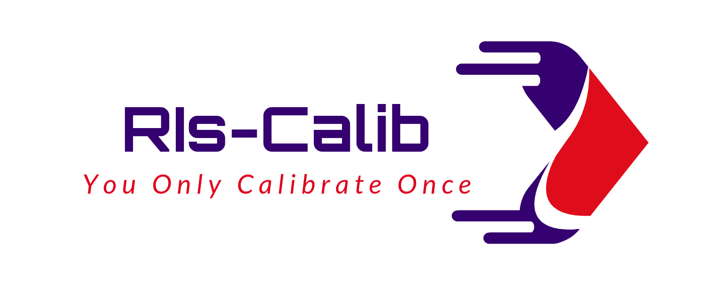
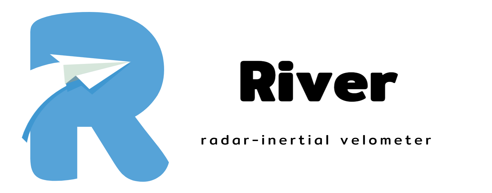
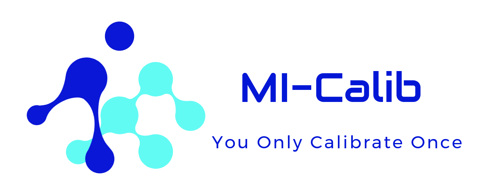
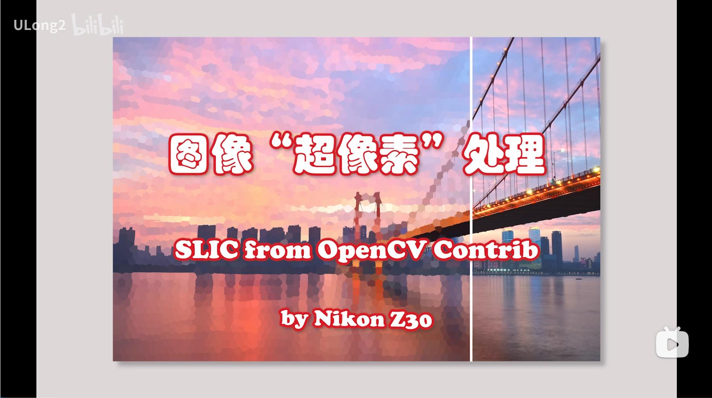
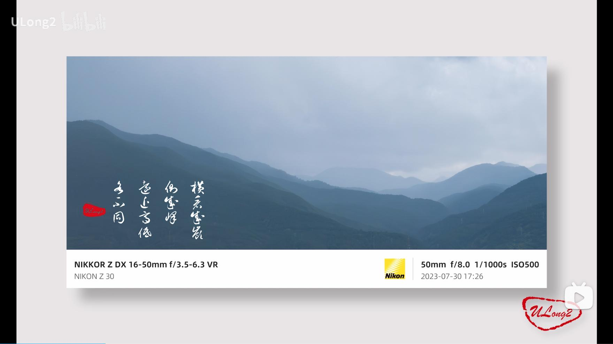

        

 

I'm currently a master candidate at the School of Geodesy and Geomatics ([SGG](http://www.sgg.whu.edu.cn)), Wuhan University ([WHU](https://www.whu.edu.cn/)). My area of research currently focuses on integrated navigation systems and multi-sensor fusion. I'm working on the continue-time-based (B-spline-based) state estimation currently :smiley:.

#### About Me

- Student at [Wuhan University](https://www.whu.edu.cn/), E-Mail: shlchen@whu.edu.cn.
- A brief introduction about me can be found [here](https://mp.weixin.qq.com/s?__biz=MzAwNzA1NjM1Nw==&mid=2650079632&idx=1&sn=8b6a07fe25428daef54f6ec1bbbd8d7e&chksm=82cc8e75e3675a0b2388fd2edc6952f711c142edf799660c8a76da582bd7ca89f022d9da58ed&sessionid=1720928399&scene=126&subscene=91&clicktime=1720928409&enterid=1720928409&ascene=3&fasttmpl_type=0&fasttmpl_fullversion=7291193-zh_CN-zip&fasttmpl_flag=0&realreporttime=1720928409600&devicetype=android-29&version=28003251&nettype=WIFI&abtest_cookie=AAACAA%3D%3D&lang=zh_CN&session_us=gh_969f2b272795&countrycode=CN&exportkey=n_ChQIAhIQP0Ncs2B5Xxi6Y0%2BRQ%2F%2FhkhLxAQIE97dBBAEAAAAAAHf6NzquHPQAAAAOpnltbLcz9gKNyK89dVj06FXMJLN77Um0PuYLHhyqPTTpkTiykQpt%2Fm3tWXVt9HRRxnjfyjrt20DzXGWRPE4I3EkcYzkM9VbEaqcgbN6xeEfArSDaiVOFe%2BsiHvhrklgJ8%2BWYbaz2uyXpCJN62Ogla2r33tqm%2BW%2BQMV5TqKepnPfKPQXY9EK%2BXCe1hf%2BTES9cIS6qG69la4Ut6%2BEfbUg%2BUjuKTDpvFH8DLcqZOiGbydYBCc5pSWBnCUtrrYxb%2By0RlK0Q109AzcKNvHNHA2JFYN4CFxqj98lpBxI%3D&pass_ticket=KEmkSpAmOdDcUK%2B1AcTDibYbFBlUGXxd19IFfLyZquALngsj%2BIx24%2BYXkcVKgYw3&wx_header=3).
- I love photography, I also love writing cpp (cplusplus) and creating funny toy libraries.
- Ask me about anything [here](https://github.com/Unsigned-Long/Unsigned-Long/issues).

#### Open-Source Works
+ [**RIs-Calib**](https://github.com/Unsigned-Long/RIs-Calib): a targetless continuous-time-based multi-radar multi-IMU **spatiotemporal calibrator**.
+ [**River**](https://github.com/Unsigned-Long/River.git): a continuous-time-based radar-inertial **velocity estimator**.
+ [**MI-Calib**](https://github.com/Unsigned-Long/MI-Calib): a continuous-time-based imu-only multi-IMU **spatiotemporal calibrator**.
+ **[iKalibr](https://github.com/Unsigned-Long/iKalibr.git)**: **unified** targetless spatiotemporal calibration for **resilient integrated inertial systems**.

  

   
  
  
    
  

#### Research Works

- **iKalibr** (under review :sleeping:): a continuous-time, targetless, unified **spatiotemporal calibrator**. Related paper(s) :point_down::
  - **S. Chen**, X. Li*, S. Li, Y. Zhou and X. Yang, iKalibr: Unified Targetless Spatiotemporal Calibration for Resilient Integrated Inertial Systems[J]. arXiv:2407.11420 [cs.RO]. [[paper-arXiv](https://arxiv.org/abs/2407.11420)] [[code](https://github.com/Unsigned-Long/iKalibr.git)] [[video](https://www.bilibili.com/video/BV1Dm421G7FV/?vd_source=87245258ec5029cca67d77cef1a6201d)]

- **MI-Calib**: a continuous-time-based multi-IMU **spatiotemporal calibrator**. Related paper(s) :point_down::
  - **S. Chen**, X. Li*, S. Li, Y. Zhou and S. Wang, "MI-Calib: An Open-Source Spatiotemporal Calibrator for Multiple IMUs Based on Continuous-Time Batch Optimization," in IEEE Robotics and Automation Letters (RA-L), 2024. [[paper](https://ieeexplore.ieee.org/document/10629054)] [[code](https://github.com/Unsigned-Long/MI-Calib.git)] [[video](https://www.bilibili.com/video/BV1hK4y1i7uM/)]

- **River**: a continuous-time-based radar-inertial **velocity estimator**.  Related paper(s) :point_down::
  - **S. Chen**, X. Li*, S. Li, Y. Zhou and S. Wang, "River: A Tightly-Coupled Radar-Inertial Velocity Estimator Based on Continuous-Time Optimization," in IEEE Robotics and Automation Letters (RA-L), 2024. [[paper](https://ieeexplore.ieee.org/document/10529532)] [[code](https://github.com/Unsigned-Long/River)] [[video](https://www.bilibili.com/video/BV15D421W7NX/)]
- **RIs-Calib** (under review :sleeping:): a targetless multi-radar multi-IMU **spatiotemporal calibrator**. Related paper(s) :point_down::
  - **S. Chen**, X. Li*, S. Li, Y. Zhou and S. Wang, RIs-Calib: An Open-Source Spatiotemporal Calibrator for Multiple 3D Radars And IMUs Based on Continuous-Time Estimation. arXiv:2408.02444 [cs.RO]. [[paper-arXiv](https://arxiv.org/abs/2408.02444)] [[code](https://github.com/Unsigned-Long/RIs-Calib)] [[video](https://www.bilibili.com/video/BV1pw411y7NR/?vd_source=87245258ec5029cca67d77cef1a6201d)]

- **ELIC-Calib**: the extend version of `LIC-Calib`, a targetless continuous-time-based multi-LiDAR multi-IMU multi-camera **spatiotemporal calibrator**. Related paper(s) :point_down::
  - **S. Chen**, X. Li*, S. Li, Y. Zhou and S. Wang, "Targetless Spatiotemporal Calibration for Multiple Heterogeneous Cameras And IMUs Based on Continuous-Time Trajectory Estimation," in IEEE Transactions on Instrumentation and Measurement (TIM), 2023. [[paper](https://ieeexplore.ieee.org/document/10301598)]
  - S. Li, X. Li*, **S. Chen**, Y. Zhou and S. Wang, "Targetless Spatiotemporal Calibration of Multi-LiDAR Multi-IMU System Based on Continuous-Time Optimization," in IEEE Transactions on Industrial Informatics (TII), 2024. [[paper](https://ieeexplore.ieee.org/document/10443246)]
- **LIC-Calib**: a targetless continuous-time-based LiDAR/IMU/Camera **spatiotemporal calibrator**, supporting both GS and RS cameras. Related paper(s) :point_down:: 
  - S. Li, X. Li*, **S. Chen**, Y. Zhou and S. Wang, "Two-Step LiDAR/Camera/IMU Spatial And Temporal Calibration Based on Continuous-Time Trajectory Estimation," in IEEE Transactions on Industrial Electronics (TIE), 2023. [[paper](https://ieeexplore.ieee.org/document/10113826)]
  -  X. Li, **S. Chen**, S. Li*, Y. Zhou and S. Wang, "Accurate And Consistent Spatiotemporal Calibration for Heterogenous-Camera/IMU/LiDAR System Based on Continuous-Time Batch Estimation," in IEEE/ASME Transactions on Mechatronics (T-Mech), 2023. [[paper](https://ieeexplore.ieee.org/document/10288412)]

#### Interesting Point

So why is my nickname **ULong2** :smiley:? `ULong` is a data type in C++ that stands for `unsigned long integer`, which can store a large number, but no negative numbers are allowed. This represents my desire to explore a wide range of knowledge and a positive (non-negative) mindset. Interestingly, `Long` is also the pinyin for one of the Chinese characters in my name. And the number `2`, yes, is my lucky number.

#### My BiliBili Channel

#### My Status

|||
|  :---:  |  ---:  |

 

      
      
      
      
      
      
      
      
      
 

        

