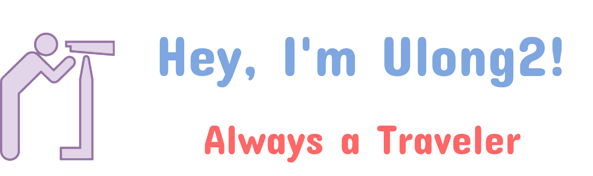

        

 I'm currently a bachelor's candidate at Wuhan University. My area of research currently focuses on integrated navigation systems and multi-sensor fusion.

#### About me

- Student at [Wuhan University](https://www.whu.edu.cn/), e-mail: shlchen@whu.edu.cn.
- I'm working on the spatiotemporal calibration for multi-sensor systems based on continue-time estimation currently, corresponding projects, i.e., [LIC_Calib](https://github.com/Unsigned-Long/LIC-Calib), [ELIC_Calib](https://github.com/Unsigned-Long/ELIC-Calib) and [RIC_Calib](https://github.com/Unsigned-Long/RIC-Calib), will be open source when necessary.
- I love writing cpp (cplusplus), and creating funny toy libraries.
- Ask me about anything [here](https://github.com/Unsigned-Long/Unsigned-Long/issues).

#### Interesting Point

So why is my nickname **ULong2**? ULong refers to the unsigned long data type inside cpp, which is a type capable of storing a large range of non-negative integer data. This somehow represents my desire to explore a wide range of knowledge and a positive (non-negative) mindset. Interestingly, 'long' is also the pinyin for one of the Chinese characters in my name. And the number 2, yes, is my lucky number.

 

      
      
      
      
      
      
      
      
      
 

|  |  |
| ------------- | ------------- |

#### Repositories

    

    

    
 
 

        

